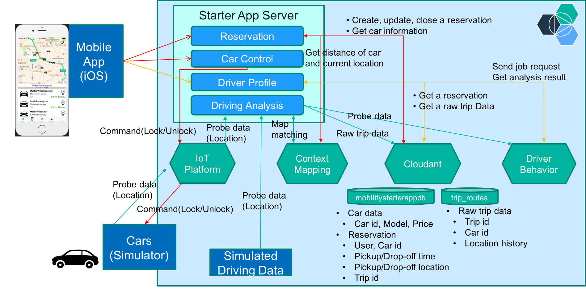

# IoT for Automotive Starter app
A demo app that uses Internet of Things Platform, Context Mapping and Driver Behavior services.

## Overview
With IoT for Automotive Starter app, you will experience a simulation of how Tom, an automobile owner and driver, can use a mobile app to rent a car provided by an automotive company. This new type of service will help the automotive company attract and retain customers. The design of future cars and services can be based on this new source of customer and vehicle data. You will use a mobile app on an iOS phone and experience how Tom can find an available car located near him and reserve the car. You will experience how Tom can review his driving behavior, which is analyzed by Driver Behavior service on Bluemix.

This app demonstrates how quickly you can build an app on Bluemix using the following services:

   * [IBM Watson IoT Context Mapping](https://console.ng.bluemix.net/catalog/services/context-mapping/)
   * [IBM Watson IoT Driver Behavior](https://console.ng.bluemix.net/catalog/services/driver-behavior/)
   * [IBM Watson IoT Platform](https://console.ng.bluemix.net/catalog/services/internet-of-things-platform/)
   * [Cloudant NoSQL DB](https://console.ng.bluemix.net/catalog/services/cloudant-nosql-db/)
   * [Weather Company Data for IBM Bluemix](https://console.ng.bluemix.net/catalog/services/weather-company-data-for-ibm-bluemix/)
   * [Push Notifications](https://console.ng.bluemix.net/catalog/services/push-notifications/)
   * [Mobile Client Access](https://console.ng.bluemix.net/catalog/services/mobile-client-access/)

You can follow the steps below to set up the IoT for Automotive Starter app.

## Application Requirements
You need to install a mobile application on an iOS phone to experience the simulation.
A mobile application source code is available in [this GitHub repository](https://github.com/ibm-watson-iot/iota-starter-carsharing)

## Deploy the app on Bluemix
You can deploy your own instance of IoT Automotive Starter app to Bluemix.
To do this, you can either use the _Deploy to Bluemix_ button for an automated deployment or follow the steps below to create and deploy your app manually.

[](https://bluemix.net/deploy?repository=https://github.com/ibm-watson-iot/iota-starter-server.git)

1. Create a Bluemix Account.

  [Sign up][bluemix_signup_url] for Bluemix, or use an existing account.

2. Download and install the [Cloud-foundry CLI][cloud_foundry_url] tool.

3. Clone the app to your local environment from your terminal using the following command:

  ```
  git clone https://github.com/ibm-watson-iot/iota-starter-server.git
  ```

4. `cd` into this newly created directory.

5. Edit the `manifest.yml` file and change the `<name>` and `<host>` to something unique.

  ```
  applications:
         :
    disk_quota: 1024M
    host: iot-automotive-starter
    name: IoT-Automotive-Starter
    path: .
    instances: 1
    memory: 640M
         :
  ```
  The host you use will determinate your application URL initially, for example, `<host>.mybluemix.net`.

6. Connect to Bluemix in the command line tool and follow the prompts to log in:

  ```
  $ cf api https://api.ng.bluemix.net
  $ cf login
  ```

7. Create Internet of Things Platform, Context Mapping and Driver Behavior service in Bluemix.

  ```
  $ cf create-service iotf-service iotf-service-free IoTPlatform
  $ cf create-service mapinsights free ContextMapping
  $ cf create-service driverinsights free DriverBehavior
  ```

8. This app uses Cloudant NoSQL DB and Weather Company Data service as well. Create the services in Bluemix.

  ```
  $ cf create-service cloudantNoSQLDB Shared MobilityDB
  $ cf create-service weatherinsights Free-v2 WeatherInsights
  ```

9. Push the app to Bluemix. You need to perform additional steps when it is deployed, so you must add the option --no-start argument.

  ```
  $ cf push --no-start
  ```

You now have your very own instance of the IoT for Automotive Starter app on Bluemix.  

## Before using the app
Before using the IoT for Automotive Starter app, you need to set up services and install a mobile app.

### Activate Context Mapping and Driver Behavior services  
Follow the steps below to make the Context Mapping and Driver Behavior services ready for use.

1. Make sure that the app is not running on Bluemix.

2. Open the [Bluemix dashboard][bluemix_dashboard_url] in your browser.

3. Open the Context Mapping service and wait for a few seconds until credentials show up.

4. Likewise, open the Driver Behavior service from the dashboard.

### (Optional) Setup Push Notifications Service
You can enable push notifications when the weather at the drop off time of your car reservation becomes bad. Follow the steps below to make the Push Notifications service ready for use.

1. Open the [Bluemix dashboard][bluemix_dashboard_url] in your browser.

2. Open the created app

3. Click ADD A SERVICE OR API button

4. Select Push Notifications in the catalog

5. Click CREATE button

6. Open the created Push Notifications service

7. Click Setup Push button

8. Register your Apple Push Notification Service certificate

See [Configuring credentials for Apple push notifications](https://console.ng.bluemix.net/docs/services/mobilepush/t_push_provider_ios.html) for more information.

### (Optional) Setup Mobile Client Access service
The app provides a simple custom authentication service. If you want to use the service then configure the Mobile Client Access service for Bluemix to enable the authentication.

1. Open the [Bluemix dashboard][bluemix_dashboard_url] in your browser

2. Open the created app.

3. Click ADD A SERVICE OR API button.

4. Select Mobile Client Access in the catalog.

5. Click CREATE button.

6. Open the created Mobile Client Access service.

7. Click the _Configure_ button under _Custom_.

8. Enter the following authentication credentials.  
__Realm name__ : `custauth`  
__URL__ : `https://<host>.mybluemix.net`

9. Click Save button.

10. In your [Bluemix dashboard][bluemix_dashboard_url], open the app.

11. Click the _Environment Variables_ in the left bar.

12. Open USER_DEFINED.

13. Add the following variable and save it.  
__Name__ : `MCA_AUTHENTICATION`  
__Value__ : `true`

Once you enable the authentication, you can log in to the app with username `tom` and password `tom`.  

See [Configuring Mobile Client Access for custom authentication](https://console.ng.bluemix.net/docs/services/mobileaccess/custom-auth-config-mca.html) for more information.

### Build and install a mobile app
If you have not installed a mobile app on your iOS phone, follow the [instructions][mobile_app_readme].

## Start the app
1. Open the [Bluemix dashboard][bluemix_dashboard_url] in your browser.

2. Start the app.

Congratulations! You are ready to use your own instance of IoT for Automotive Starter app now. Open `http://<host>.mybluemix.net` in your browser and follow the instructions in the top page to connect your mobile app to the IoT for Automotive Starter app.


## (Optional) Connect your own device to the app
When you start your mobile app, you might see some cars around the current location in the map. They are simulated cars generated automatically by a simulation engine of the app. Instead of them, you can try with your own sensor device that can send location data by registering it to the app as follows.

### Disable a simulation engine
Simulated cars and your device can coexist. However, you can disable simulated cars if you do not want to see them.

1. In your [Bluemix dashboard][bluemix_dashboard_url], open the app.

2. Stop the app.

3. Click the _Environment Variables_ in the left bar.

4. Open USER_DEFINED.

5. Add the following variable and save it.
```
DISABLE_DEMO_CAR_DEVICES=true
```
6. Restart the app.

### Register your device
To show your device on a map on the mobile app, you need to register your device firstly.

1. Open `http://<host>.mybluemix.net/admin/ui/device` in your browser.

2. Input credentials for the page and click _OK_. By default, the credentials are ADMIN/ADMIN.

3. If you see simulated cars in the list, you can delete them.  A device type for simulated cars is __ConnectedCarDevice__.

4. click _Create_ button.

5. Fill out the form and click _Create_ button.

  You can leave device ID blank. If it is blank, 8-digit ID will be generated automatically. Otherwise, you can specify unique ID that identifies your device (e.g. MAC address).

6. Go back to the list page and confirm that your car name and photo is shown in the list.

Credentials for vehicle management page are set to ADMIN/ADMIN by default. However, they can be changed with environment variables.
```
ADMIN_USER=<administrator name>
ADMIN_PASSWORD=<administrator password>
```

Your sensor device needs to publish car probe data like location and speed to the Internet of Things Platform in order to create your own trip data. If your device is registered with the above form successfully, the device is added to the Internet of Things Platform with the device type  __UserOwnedCarDevice__.

You can also add your device to the Internet of Things Platform by yourself. See the following IBM Watson IoT Platform pages.
 * [Quickstart](https://quickstart.internetofthings.ibmcloud.com/)
 * [How to Register Devices in IBM Watson IoT Platform](https://developer.ibm.com/recipes/tutorials/how-to-register-devices-in-ibm-iot-foundation/)


 ### Connect your device to the Internet of Things Platform

Once your device is registered to the Internet of Things Platform, your device can connect to the Internet of Things Platform and send car probe data using credentials assigned for your device.

To make the settings easier, the app provides the lightweight API to get credentials.
```
GET /user/device/credentials/:deviceId
```
Note that you need to disable the Mobile Client Access service to call the API from your device. The deviceId is the ID that has been assigned to your device. If you have not registered your device with the above step, the API will register your device automatically with specified ID and returns credentials for it. In this case, default car information (e.g. name, photo, car model and so on) is assigned automatically. The default name is __User owned car__.

### Modify car details
If you want to modify car information, follow the steps below.

1. Open `http://<host>.mybluemix.net/admin/ui/device` in your browser.

2. Input credentials for the page and click _OK_. By default, the credentials are ADMIN/ADMIN.

3. Click your deviceID to open Car details page.

4. Modify values and click _Update_ button.

5. Go back to the list page and confirm that your car name and photo have been updated correctly.

### Data format
Your device is expected to publish car probe data to the Internet of Things Platform in the following format.

```
{
  "d": {
    "lat": <latitude in double>,
    "lng": <longitude in double>,
    "trip_id": "<trip id in string>",
    "speed": <vehicle speed in double (km/h)>
  }
}
```
The `lat` and `lng` are required to show your car on a map on your mobile app. Set the  location of your device as values of the `lat` and `lng`. When you record your trip route after you reserve the car, the `trip_id` and `speed` are also required. The same `trip_id` must be set during the reservation.

### Create trip data with your device
Now you are ready to create your trip data with your device. Follow the steps below.

1. Connect your device to the Internet of Things Platform.

2. Start sending the latest location data from the device. Keep sending it at short intervals.

3. Start the mobile app and show the current location on a map. Note that the device must be located at the same location.

4. Select your car and reserve it on the mobile app.

5. Unlock the car on the mobile app.

6. Generate unique trip id on the device and send it along with real-time location and speed data at short intervals.

7. Start driving with the device.

8. Stop driving. Stop sending the trip_id from the device.

9. Lock the car and complete the reservation on your mobile app.

You can see your trip route on Trips tab and driving behavior on Profile tab. It may take some minutes to analyze your trip data.

### Use the mobile app to create trip data
If you reserve a simulated car and unlock it on the mobile app, the simulated car start running automatically around the location until the reservation is completed. You can see the simulated trip route and its driving behaviors on the mobile app after you complete the reservation.

Also, the mobile app provides a capability to send car probe data. Therefore, instead of your own sensor device, you can use the mobile app to record your trip data easily without complex device settings described above. Select the _Analyze My Driving_ option at the top page of the mobile app. The mobile app registers itself to the Internet of Things Platform and starts sending probe data. And, by driving around with your iOS phone, data from your mobile app are recorded and analyzed in the app.


## Implementation

The following diagram shows the components involved in the application and flows between the components. 	



* **Reservation** handles a request related to a reservation. [routes/user/reservation.js](routes/user/reservation.js) has the implementation.
* **Car Control** gets a request for controlling a car device e.g. unlock and lock a car. It sends a command to the target car through IoT Platform. [routes/user/reservation.js](routes/user/reservation.js) contains implementation for /carControl end point.
* **Driver Profile** handles a request to access driver's behaviors using Driver Behavior service. [routes/user/insights.js](routes/user/insights.js) defines the end point and [driverInsights/analyze.js](driverInsights/analyze.js) has the implementation.
* **Driving Analysis** gets events containing probe data from registered cars through IoT Platform and sends the probe data to Context Mapping service to get the corrected location, then sends the corrected location to Driver Behavior service to get the driver's behaviors. [driverInsights/probe.js](driverInsights/probe.js) is the entry point to explore the implementation. It also stores the probe data to Cloudant database "trip_route" that is used to retrieve a trip route (see [driverInsights/tripRoutes.js](driverInsights/tripRoutes.js)).
* **Monitoring System** provides a dashboard showing real-time information about cars and reservations, and information about driver's behaviors extracted from probe data by Driver Behavior service. The Map page pulls car status and reservation information via HTTP requests, and also receives car probe events relayed by IoT Platform via Web Socket connection. The page aggregates those informations to visualize the real-time state of cars on a map. The Users page shows statistics of driving behaviors associated to users' reservations. The server side implementation periodically, every two hours by default, extracts driving behavior information from the __Reservation__ and the __Driver Profile__ components and caches them to a database. The page gets the statistics from the database via HTTP requests. The implementation includes static files in [public/monitoring](public/monitoring) folder and server-side implementations in [routes/monitoring](routes/monitoring) folder which provides the end points and data synchronization.

* **Simulated Driving Data** is preset driving data under [devicesSimulation/data](devicesSimulation/data) folder. The data is passed to Driving Analysis directly in [devicesSimulation/simulationImporter.js](devicesSimulation/simulationImporter.js) that is called in [_app.js](_app.js).
* **Cars (Simulator)** simulates car behaviors. The implementation is under [devicesSimulationEngine](devicesSimulationEngine) folder.


## Report Bugs
If you find a bug, please report it using the [Issues section](https://github.com/ibm-watson-iot/iota-starter-server/issues).

## Troubleshooting
The primary source of debugging information for your Bluemix app is the logs. To see them, run the following command using the Cloud Foundry CLI:

  ```
  $ cf logs <application-name> --recent
  ```
For more detailed information on troubleshooting your application, see the [Troubleshooting section](https://www.ng.bluemix.net/docs/troubleshoot/tr.html) in the Bluemix documentation.

## Privacy Notice

The IoT for Automotive Starter app includes code to track deployments to [IBM Bluemix](https://www.bluemix.net/) and other Cloud Foundry platforms. The following information is sent to a [Deployment Tracker](https://github.com/cloudant-labs/deployment-tracker) service on each deployment:

* Application Name (`application_name`)
* Space ID (`space_id`)
* Application Version (`application_version`)
* Application URIs (`application_uris`)
* Labels of bound services
* Number of instances for each bound service

This data is collected from the `VCAP_APPLICATION` and `VCAP_SERVICES` environment variables in IBM Bluemix and other Cloud Foundry platforms. This data is used by IBM to track metrics around deployments of sample applications to IBM Bluemix to measure the usefulness of our examples, so that we can continuously improve the content we offer to you. Only deployments of sample applications that include code to ping the Deployment Tracker service will be tracked.

### Disabling Deployment Tracking

Deployment tracking can be disabled by removing `require("cf-deployment-tracker-client").track();` from the beginning of the `app.js` main server file.

## Useful links
[IBM Bluemix](https://bluemix.net/)  
[IBM Bluemix Documentation](https://www.ng.bluemix.net/docs/)  
[IBM Bluemix Developers Community](http://developer.ibm.com/bluemix)  
[IBM Watson Internet of Things](http://www.ibm.com/internet-of-things/)  
[IBM Watson IoT Platform](http://www.ibm.com/internet-of-things/iot-solutions/watson-iot-platform/)   
[IBM Watson IoT Platform Developers Community](https://developer.ibm.com/iotplatform/)

[bluemix_dashboard_url]: https://console.ng.bluemix.net/dashboard/
[bluemix_signup_url]: https://console.ng.bluemix.net/registration/
[cloud_foundry_url]: https://github.com/cloudfoundry/cli
[mobile_app_readme]: https://github.com/ibm-watson-iot/iota-starter-carsharing/blob/master/README.md
